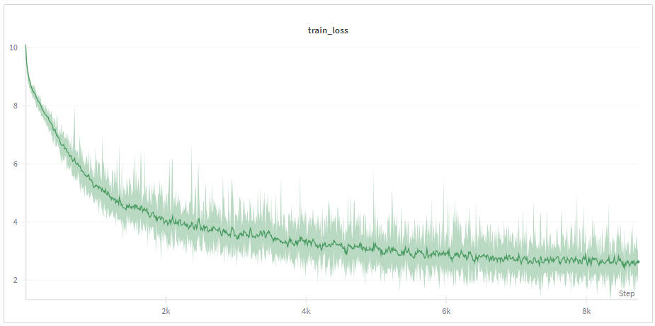
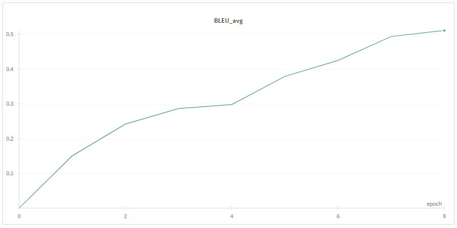

# Generative Question Answering with mengzi T5

This project implements a complete fine-tuning pipeline for **Generative Question Answering (QA)** using the mengzi T5 (Text-to-Text Transfer Transformer) architecture. Unlike extractive QA models (which select a span of text), this model generates natural language answers based on a provided context and question.

The pipeline is built with **PyTorch** and **Hugging Face Transformers**, featuring custom training loops, dynamic padding, and integrated BLEU score evaluation.

## 🚀 Key Features

*   **Custom Training Loop:** Implements a manual training loop (`train_loop`) and validation loop (`valid_loop`) for granular control over the optimization process.
*   **Generative QA:** Formats inputs as `问题: [Question] 上下文: [Context]` to leverage T5's sequence-to-sequence capabilities.
*   **Robust Evaluation:** Calculates **BLEU-1, BLEU-2, BLEU-3, and BLEU-4** scores during validation to measure generation quality.
*   **Experiment Tracking:** Integrated with **Weights & Biases (WandB)** for real-time logging of loss and metrics.
*   **Smart Checkpointing:** Automatically saves model checkpoints and manages storage by keeping only the `max_keep` most recent models.
*   **Dynamic Data Handling:** Supports JSONL data loading and handles variable answer formats (single string or list of valid answers).

## 📂 Data Format

The project expects the input data to be in **JSON Lines (JSONL)** format. Each line should be a valid JSON object containing the following fields:

```json
{
  "id": "unique_sample_id",
  "context": "The full text paragraph containing the information.",
  "question": "The question to be answered based on the context.",
  "answer": "The correct answer string" 
}
```
*Note: The code also supports `answer` as a list of strings `["Answer A", "Answer B"]` for validation purposes.*

## 🛠️ Installation

Ensure you have Python 3.8+ and install the required dependencies:

```bash
bash set_up.sh
```

## ⚙️ Configuration

The pipeline uses the following default hyperparameters (adjustable in the code):

| Parameter | Value | Description |
| :--- | :--- | :--- |
| **Model Architecture** | T5 (Base/Small) | Can be swapped for `google/mt5-base` for multilingual support. |
| **Max Input Length** | 512 | Max tokens for Question + Context. |
| **Max Target Length** | 128 | Max tokens for the generated Answer. |
| **Learning Rate** | 1e-4 | Conservative rate for stable fine-tuning. |
| **Epochs** | 5 | Standard duration for convergence. |

## 🧠 How It Works

### 1. Data Preprocessing
The `collote_train_fn` processes the data into the T5 format:
*   **Input:** `问题: {question} 上下文: {context}`
*   **Target:** `{answer}`
*   **Padding:** Inputs are padded to `MAX_INPUT_LENGTH`, and labels are padded to `MAX_TARGET_LENGTH`. Padding tokens in labels are replaced with `-100` to ignore them during loss calculation.

### 2. Training (`train_loop`)
*   Iterates through the dataloader.
*   Performs forward pass and calculates Cross-Entropy Loss.
*   Updates weights via Backpropagation.
*   Logs training loss to WandB/Console.

### 3. Validation (`valid_loop`)
*   Generates answers using `model.generate()` with **Beam Search** (num_beams=4).
*   Decodes the generated tokens into text.
*   Compares predictions against reference answers using the **BLEU** metric.
*   **Note on Chinese Evaluation:** The validation loop includes logic to space-separate characters for accurate BLEU calculation on Chinese text.

## 📊 Metrics

The model performance is evaluated using:
*   **Loss:** Cross-Entropy Loss (lower is better).
*   **BLEU Score:** Measures the overlap between the generated answer and the ground truth (higher is better). The pipeline reports the average BLEU as well as precision for 1-grams through 4-grams.




| Epoch | BLEU | BLEU-1 | BLEU-2 | BLEU-3 | BLEU-4 |
| :--- | :--- | :--- | :--- | :--- | :--- |
| **0** | 0 | 0.448 | 0.337 | 0.284 | 0.302 |
| **1** | 0.151 | 0.387 | 0.232 | 0.145 | 0.081 | 
| **2** | 0.242 | 0.440 | 0.297 | 0.208 | 0.136 |
| **3** | 0.287 | 0.539 | 0.391 | 0.294 | 0.214 |
| **4** | 0.298 | 0.489 | 0.348 | 0.255 | 0.186 |
| *Reload* | *--* | *--* | *--* | *--* | *--* |
| **5** | 0.379 | 0.539 | 0.421 | 0.341 | 0.267 |
| **6** | 0.425 | 0.587 | 0.466 | 0.382 | 0.313 |
| **7** | 0.494 | 0.630 | 0.531 | 0.456 | 0.389 |
| **8** | 0.511 | 0.642 | 0.545 | 0.473 | 0.412 |
| **9** | 0.564 | 0.688 | 0.595 | 0.528 | 0.469 |

* Note: The examples of using the model can be read in the end of train.ipynb and test.ipynb.
